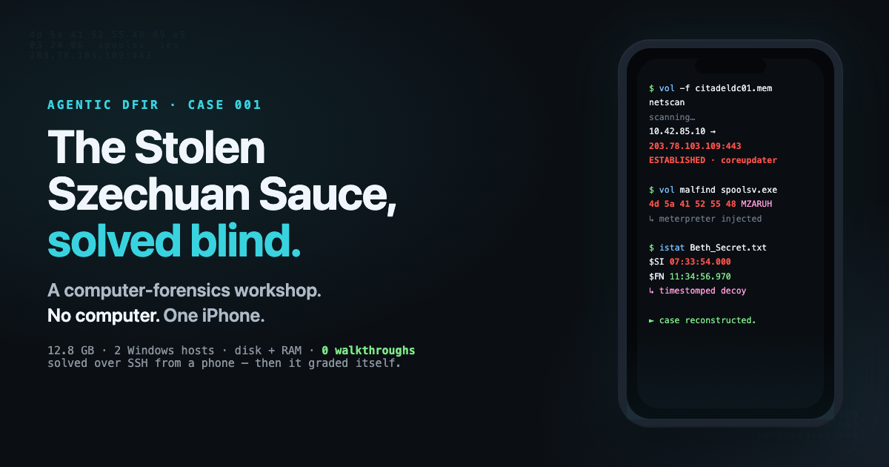
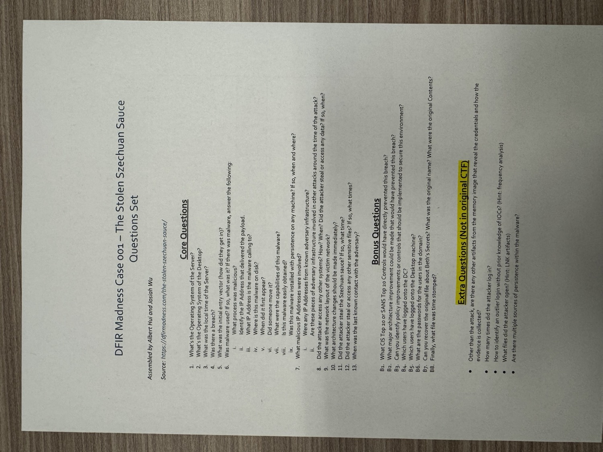
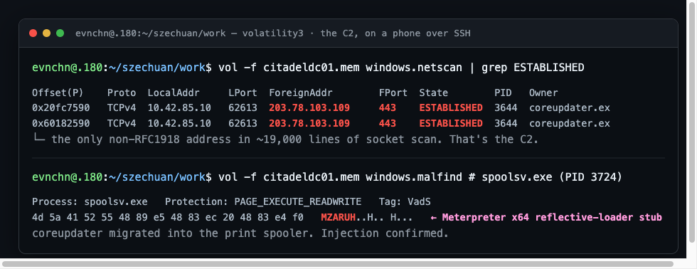
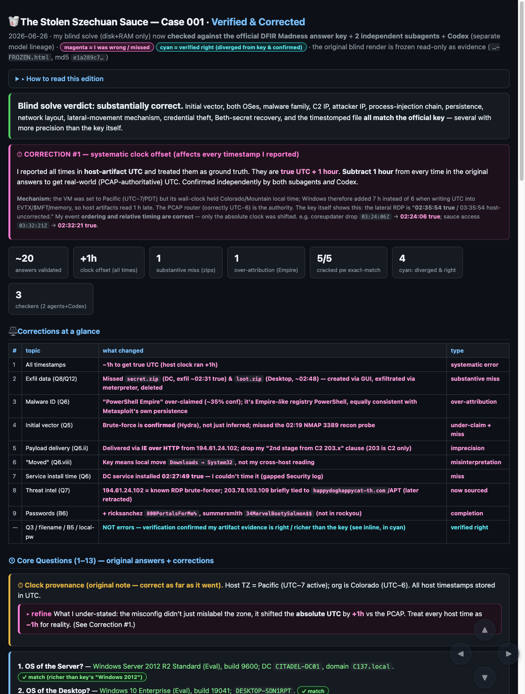

# Agentic DFIR — The Stolen Szechuan Sauce, solved blind

**An AI agent works a full incident-response case end-to-end — two dead Windows machines, 12.8 GB of disk and memory — never reading the answer key, then grades its own homework against the official solution and three reviewers. The catch: the whole thing was driven from an iPhone, because the operator turned up to a computer-forensics workshop without a computer.**



> Built entirely through agentic coding with [Claude Code](https://claude.com/claude-code). The case is [DFIR Madness Case 001 — "The Stolen Szechuan Sauce"](https://dfirmadness.com/the-stolen-szechuan-sauce/) by James Smith; the question set is the BSidesHK workshop edition by Albert Hui & Josiah Wu. **The agent was told once: "Try and agentically solve it. Never peek at the answer."** It didn't. **Final tally: 26 questions worked blind, 0 walkthroughs read, 3 honest mistakes kept in.** Investigation by agent; evidence by DFIR Madness; ground truth by the published answer key — consulted only *after* the solve was frozen.

*(This is a 拋磚引玉 brick — a fast first pass shipped to attract refinement. The forensics are verified; the prose is draft-grade. Rough edges are named at the [bottom](#-brick-edges-where-the-jade-comes-in).)*

---

## What This Is

Two artifacts, both real outputs of the run, both in [`renders/`](renders/):

| | what | open it |
|---|---|---|
| **The blind solve** | What the agent concluded from disk + RAM alone, before it had ever seen the official answers. Frozen read-only as evidence. | [`renders/01-blind-solve-FROZEN.html`](renders/01-blind-solve-FROZEN.html) |
| **The reckoning** | The same answers re-checked against the official key + 2 subagents + Codex. <span>🟢 right · 🟣 wrong · 🔵 diverged-and-confirmed-right.</span> | [`renders/02-verified-corrected.html`](renders/02-verified-corrected.html) |

Both are self-contained dark-theme HTML dashboards ([rich renders](https://github.com/evnchn-agentic/rich-render)) — download and open in any browser, no server.

**The headline:** the agent reconstructed the entire attack — initial RDP, the malware, the C2, credential theft, lateral movement, data theft, the cover-up — and was *correct on every load-bearing fact*, frequently more precise than the answer key. It also made exactly three honest mistakes, which are the most interesting part of the story.

```
   194.61.24.102 (attacker)                      203.78.103.109:443 (C2)
        │  RDP brute-force (Hydra)                        ▲
        ▼                                                 │ meterpreter beacon
  ┌─────────────────────┐   coreupdater.exe   ┌───────────┴──────────┐
  │  CITADEL-DC01 (.10)  │  ── injects ──────▶ │  spoolsv.exe (PID … ) │
  │  Server 2012 R2 · DC │                     └──────────────────────┘
  │  domain  C137.local  │   ░ dumps NTDS · reads the secrets · timestomps a decoy
  └─────────┬───────────┘
            │  RDP from the DC, as Domain Admin (stolen creds)
            ▼
  ┌──────────────────────────┐
  │ DESKTOP-SDN1RPT (.115)    │  same coreupdater.exe, same C2, same persistence
  │ Windows 10 Enterprise     │  loot.zip staged, exfiltrated, deleted
  └──────────────────────────┘
```

---

## The Journey

### Act 0 — A forensics workshop, and no computer

Here is the actual origin, in case it isn't obvious: the operator was sitting in a **BSidesHK blue-team DFIR workshop** — the kind that hands you 12.8 GB of disk and memory images and says *get to work* — and had shown up **without a laptop**. The only machine in hand was an **iPhone**.

So the session opened not with forensics but with a workaround: *"set up a web server for me to upload some 10 GB."* Get the evidence somewhere a real computer could reach it. Three clarifying questions in, the operator pivoted — the 10 GB **was** the case, and the workaround dissolved into the task itself: *"Try and agentically solve it. Never peek at the answer!"*

No upload server ever got built. From here on, every forensic command ran on a homelab node over SSH — and the entire human side of it happened on a **phone screen, over [Claude Code](https://claude.com/claude-code) remote control.** A computer-forensics exam, answered without a computer in the room.


*What you actually get: 26 questions on paper. No tidy artifact bundle, no answer key — and, that morning, no laptop.*

So the scope: two hosts on domain **C137** (yes, Rick & Morty) — a Server 2012 R2 **Domain Controller** and a Windows 10 **Enterprise** workstation — as a disk image (`.E01`) and a raw memory dump each. ~12.8 GB. No PCAP, no pre-extracted artifacts. The workshop's whole point: *work from what you actually get, not a tidy bundle.*

### Act 1 — Getting the bytes (the agent vs. a 403)

The evidence lives on dfirmadness.com, which **403s every automated client** — curl, a US-based fetch, even a headless browser all bounced. The operator was on a bad 3G link and couldn't upload it.

The break was empirical: it wasn't a Cloudflare JS gate, it was plain **Apache hotlink protection**. A request carrying a browser `User-Agent` **and** a `Referer: https://dfirmadness.com/the-stolen-szechuan-sauce/` header sails straight through with `HTTP 200`. The agent pulled all 12.8 GB directly onto a homelab node (`.180`, 167 GB free) via `curl`, MD5-verified every zip against the published hashes, and never needed the browser for the heavy transfer.

> **Lesson banked:** the 403 wasn't a wall, it was a referer check. Probe the *kind* of block before assuming the hard one.

### Act 2 — A forensics lab over SSH (no FTK, no EnCase, no license)

No GUI, no workstation, no licensed tooling — just `apt install` and `pip install` over an SSH session. The agent stood up a pure open-source stack on the node: `ewf-tools` + `sleuthkit` for the disks, **volatility3** for memory, `regipy` for the registry, `impacket` for credentials, `python-evtx` for the logs. (It learned the hard way that the `evtx_dump` CLIs are packaging-broken — `No module named 'scripts'` — and switched to driving the `Evtx` library directly.)

### Act 3 — Memory tells the truth the disk hides

`volatility3` on the DC's RAM cracked the case open in minutes:

- **`netscan`** → one connection to a non-RFC1918 address: `10.42.85.10:62613 → 203.78.103.109:443 ESTABLISHED`, owned by a process called **`coreupdater.exe`**. The only foreign IP in 19,000 lines of socket scan.
- **`malfind`** → `spoolsv.exe` carrying `PAGE_EXECUTE_READWRITE` regions with `MZ` headers, one beginning `4D 5A 41 52 55 48 89 E5` — `MZARUH…`, the **Meterpreter x64 reflective-loader stub**. coreupdater had migrated into the print spooler.
- **`pstree`** → coreupdater ran in **Session 2** (an RDP session) for 15 seconds and exited; an `FTK Imager.exe` running off `E:\` was the *responder's* own acquisition tool, caught in the act.


*The one non-local IP in ~19,000 lines of socket scan — the C2 — and the `MZARUH` reflective-loader stub inside `spoolsv.exe`. Real output, on a phone over SSH.*

### Act 4 — The disk, the registry, and a clock that lies

Mount the `.E01`, and the registry hands over the rest:

- **Persistence, twice over:** a `coreupdater` **service** (auto-start, LocalSystem) *and* a `Run` key launching a hidden-PowerShell base64+gzip+`IEX` stager from `HKLM\Software\9sEoCawv`.
- **The clock trap** (the workshop's signature gotcha): `TimeZoneInformation` says **Pacific (UTC−7)**, but the org is in Colorado (**UTC−6**). The agent flagged it… and then, crucially, *under-handled it* — more on that in the reckoning.

### Act 5 — The human story in the bytes

This case has a *plot*, and the artifacts narrate it:

- `C:\FileShare\Secret\Szechuan Sauce.txt` — the actual recipe (soy sauce, maple syrup, cornstarch… "From gimmesomeoven.com"). Opened by the attacker; the `Recent\*.lnk` shortcut timestamps say exactly when.
- A **deleted** file recovered from the Recycle Bin: original `SECRET_beth.txt` = *"Earth beth is the real beth."* — which the attacker **deleted and replaced** with a decoy `Beth_Secret.txt` reading *"Space Beth is the real Beth."*
- And the decoy was **timestomped**: its `$STANDARD_INFORMATION` creation backdated ~4 h with the sub-seconds zeroed, while `$FILE_NAME` kept the real time. Caught by comparing `$SI` vs `$FN` — the textbook tell.
- The domain credential store (`ntds.dit`) dumped with `secretsdump`; six of nine NT hashes cracked against rockyou with a pure-Python MD4 loop. (The Rick-&-Morty password choices are left as a reward for opening the render.)

### Act 6 — The log that survived the blackout

The DC's Security log goes **dark at 01:23 UTC**, right after a reboot — and the whole attack happens *after* that. No 4625 brute-force storm, no logon events. Dead end?

No: the **TerminalServices-LocalSessionManager** operational log survived, and event 21 carried the source IP. Initial access was an external RDP logon as `Administrator` from **`194.61.24.102`**. And the lateral move was an RDP session into the *desktop* sourced from **`10.42.85.10` — the DC itself** — the attacker hopping host-to-host with the stolen domain-admin credential. Same `coreupdater.exe`, same C2, same persistence on the second box.

### Act 7 — "OK times up." The reckoning.

Then the operator: *"OK times up. Freeze this as evidence and never edit it. Then check answers by fetching the suggested answers and getting subagents and Codex to check."*

So the blind render was frozen read-only, the official answer key was fetched (now fair game), and the work was put on trial — two independent subagents and **Codex** (a different model lineage, to catch errors a second Claude would share). The verdict:

**Correct on every load-bearing fact** — vector, malware family, C2 IP, attacker IP, the injection chain, persistence, network layout, lateral mechanism, credential theft, the recovered secret, the timestomped file, and the **5 domain passwords it cracked matched the key exactly** (6 of 9 hashes fell to rockyou) — often *more precise than the key itself* (which even has a typo: `coreupdate.exe` vs the real `coreupdater.exe`).

And three honest failures, kept in the writeup the way dmr39 keeps its 27 dead-ends:

1. **A systematic +1 h clock offset.** The agent found the UTC−7 misconfig and then *treated host time as ground truth* anyway. Every absolute timestamp it reported is one hour fast versus the PCAP-authoritative truth. Finding the trap and still stepping in it.
2. **A missed pair of exfil archives.** The agent searched the *live* filesystem for `secret.zip` / `loot.zip`, found none, and concluded "no exfil." But they were created, exfiltrated, and **deleted** — so they were never going to be in the live tree. (Post-hoc, the agent proved the fix: the **USN journal** `$Extend\$UsnJrnl:$J` still held a `Secret.zip` record, with the Windows-GUI temp `~RF*.TMP` beside it. The artifact was reachable the whole time; the agent just never parsed the journal.)
3. **An over-confident "Empire" label.** A base64+gzip+`IEX` Run-key *looks* like PowerShell Empire, but that shape is shared by msfvenom, Cobalt Strike, and generic loaders. Codex put the attribution at ~35%. The honest answer was "registry-resident PowerShell stager, framework unattributed."


*Grading its own homework against the official key + two subagents + Codex.*

The corrections live in [`renders/02-verified-corrected.html`](renders/02-verified-corrected.html), colour-coded so 🟣 *I was wrong* never wears the same colour as 🔵 *I diverged from the key and was proven right* (four times — the Pacific/UTC−7 zone, the `coreupdater.exe` spelling, a desktop user the key omits, and a local-admin password the key never lists).

---

## The scoreboard

| | |
|---|---|
| Questions answered (13 core + 8 bonus + 5 extra) | **26 / 26** |
| Load-bearing facts correct | **all of them** |
| Domain passwords matching the key | **5 / 5** (6 of 9 hashes cracked) |
| Places the agent's evidence beat the key | **4** (the cyan items) |
| Systematic errors | **1** (the +1 h clock) |
| Substantive misses | **1** (the exfil archives) |
| Over-attributions | **1** (the "Empire" label) |
| Walkthroughs consulted before freezing | **0** |

---

## What actually makes this hard

- **The misses are method failures, not knowledge gaps**, and each has a one-line guard: *every "none / not found" claim gets a second method · name a malware framework only on a byte-level signature, with a lineage-check · propagate a documented clock defect as a correction, not a footnote.*
- **Verification without an answer key is the real skill.** The agent only ran its adversarial pass *after*, against the published solution. Real cases have no key — so the durable lesson is to run the completeness critic (which artifact classes haven't I touched? USN, prefetch, shellbags…) *before* declaring done.
- **The whole thing is reproducible from a phone**, over SSH, against a node — no forensic workstation, no GUI, no licensed tooling.

## Reproduce it

The evidence is public (the referer trick is in Act 1). The toolchain is `apt install sleuthkit ewf-tools` + `pip install volatility3 regipy impacket python-evtx`. The two renders are the deliverable. A fuller command transcript is on the TODO list below — this is a brick.

---

## 🧱 Brick edges (where the jade comes in)

Named honestly, per 拋磚引玉:

- **No independent second-toolchain cross-check yet.** A different forensic toolchain run over the same evidence would corroborate (or challenge) every finding for free.
- **Images are real — except the hero, which is honestly synthetic.** The C2 terminal and the reckoning dashboard are screenshots of *actual* output; the question sheet is the real photo from the day. The hero is a **designed banner** in the repo's own palette — not a photograph, nothing staged as real (GenAI was out of credits, and faking a workshop photo would betray a repo whose whole point is honesty). Still missing: an asciinema/GIF of the live phone session.
- **Command transcript not included.** The narrative asserts the commands; it doesn't yet show them. A `transcript/` with the actual `vol3` / `istat` / `secretsdump` invocations + outputs would let a reader follow along.
- **The +1 h reconciliation deserves a diagram.** It's the subtlest part and currently lives in prose.
- **Prose is first-pass.** Voice, pacing, and the Act breaks are draft-grade; the dmr39 bar is high.

PRs, issues, and "this Act drags" notes welcome. That's the point of throwing the brick.

---

## Credits &amp; licence

- **Case 001, the evidence, and the question set** are © **DFIR Madness** ([James Smith](https://dfirmadness.com)); the workshop question set was assembled by **Albert Hui &amp; Josiah Wu**. DFIR Madness publishes the case for education and permits teachers and students to use the materials with credit to the site and its authors — this repo is that use, with credit. The **raw evidence files are not redistributed here** — only this writeup and the agent's own analysis artifacts are. The recipe in the evidence is from gimmesomeoven.com (per the case).
- **This writeup and the analysis artifacts** (the narrative, the two rich-render dashboards, the designed banner) are licensed **[CC BY 4.0](LICENSE)**.

---

*Investigation by an AI agent (Claude Code) over SSH against a homelab node. The agent solved it blind, then graded itself — and kept the mistakes in.*

---

Agents handle what a purpose-built tool like `issen` was made to do — only that agents were never *taught* like this. So imagine the agent as a **`UNIVERSAL.exe`**, and let your dream go wild.
